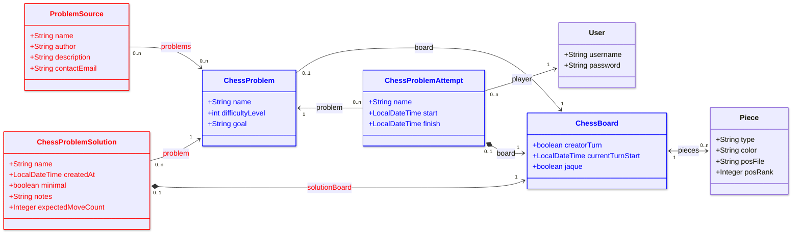

```mermaid
---
config:
  layout: dagre
  look: neo
---
classDiagram
direction LR
   
%% ========= Classes =========

class ProblemSource {
  +String name
  +String author
  +String description
  +String contactEmail
}   

class ChessProblemSolution {
  +String name
  +LocalDateTime createdAt
  +boolean minimal
  +String notes
  +Integer expectedMoveCount
}

class ChessProblem {
  +String name
  +int difficultyLevel
  +String goal
}


class ChessBoard {
  +boolean creatorTurn
  +LocalDateTime currentTurnStart
  +boolean jaque
}

class Piece {
  +String type
  +String color
  +String posFile
  +Integer posRank
}

class ChessProblemAttempt {
  +String name
  +LocalDateTime start
  +LocalDateTime finish
}
   
class User {
  +String username
  +String password
}


%% ========= Relationships =========
%% Problem -> Board (1..1)
ChessProblem "0..1" --> "1" ChessBoard : board

%% Attempt -> Player (N..1), Attempt -> Problem (N..1), Attempt -> Board (1..1)
ChessProblemAttempt "0..n" --> "1" User : player
ChessProblem "1" <-- "0..n" ChessProblemAttempt : problem
ChessProblemAttempt "0..1" *--> "1" ChessBoard : board

%% Solution -> Problem (N..1), Solution -> Board (1..1)
ChessProblemSolution "0..n" --> "1" ChessProblem : <font color='red'>problem</font>
ChessProblemSolution "0..1" *--> "1" ChessBoard : <font color='red'>solutionBoard</font>

%% ProblemSource <-> ChessProblem (N..M)
ProblemSource "0..n" --> "0..n" ChessProblem : <font color='red'>problems</font>

%% Board <-> Piece (1..*) 
ChessBoard "1" <--> "0..n" Piece : pieces


style ChessProblemSolution stroke:red,color:red	
style ProblemSource stroke:red,color:red
style ChessProblemAttempt stroke:blue,color:blue
style ChessProblem stroke:blue,color:blue
style ChessBoard stroke:blue,color:blue
```